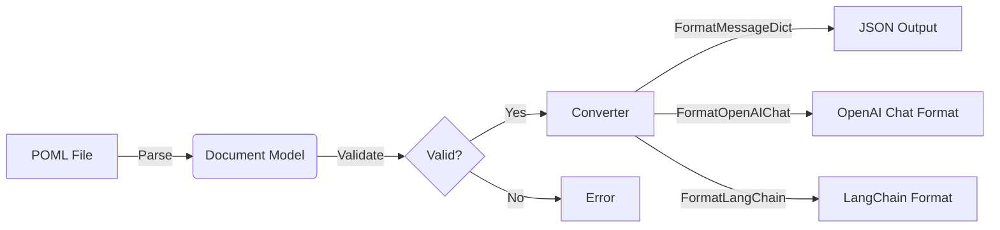
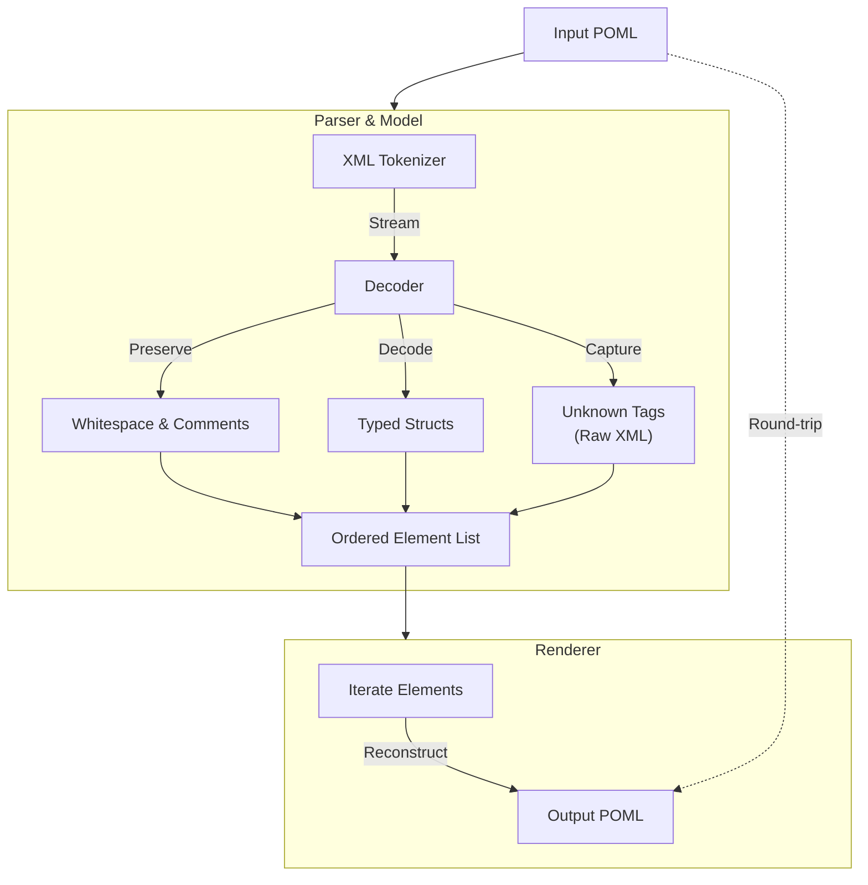

<p align="center">
  <a href="https://github.com/atlas-foundry/poml-go-sdk/actions/workflows/ci.yml">
    
  </a>
  <a href="https://github.com/atlas-foundry/poml-go-sdk/actions/workflows/ci.yml">
    
  </a>
  <a href="https://github.com/atlas-foundry/poml-go-sdk/actions/workflows/ci.yml">
    
  </a>
  <a href="https://github.com/atlas-foundry/poml-go-sdk/actions/workflows/ci.yml">
    
  </a>
  <a href="https://github.com/atlas-foundry/poml-go-sdk/actions/workflows/ci.yml">
    
  </a>

  <a href="https://github.com/atlas-foundry/poml-go-sdk/releases">
    
  </a>
</p>
<p align="center">
  <a href="https://img.shields.io/github/go-mod/go-version/atlas-foundry/poml-go-sdk">
    
  </a>
  <a href="https://github.com/atlas-foundry/poml-go-sdk/blob/main/LICENSE">
    
  </a>
  <a href="https://pkg.go.dev/github.com/atlas-foundry/poml-go-sdk">
    
  </a>
  <a href="https://goreportcard.com/report/github.com/atlas-foundry/poml-go-sdk">
    
  </a>
  <a href="https://microsoft.github.io/poml">
    
  </a>
  <a href="./go.quality.poml">
    
  </a>
  <a href="https://www.conventionalcommits.org/">
    
  </a>
</p>

# POML Go SDK — structured prompts for Go, LLMs, and tools

Open-source Go library for **Prompt Orchestration Markup Language (POML)** with lossless parsing, validation, rendering, and converters for OpenAI Chat, LangChain, scene/diagram formats, and more. Built to keep prompt markup deterministic, multi-modal, and ready for agents, CLIs, and IDE extensions.

**Highlights**
- Lossless POML parse/validate/encode with whitespace and unknown-tag preservation.
- Converters: message_dict, dict, OpenAI Chat, LangChain, scene/scenejson; deterministic options for goldens and CI.
- Extended mode: opt-in mixed text + POML (`mode="extended"`), `<op>/<figure>/<text>` blocks, unknown passthrough; strict validation enforces names/JSON args/alt/mime/size; aliases via build tags; optional embedded-tag extraction flag.
- Diagram/scene round-trips with attrs/extras; `base_document` seeding keeps meta/role/tasks when rehydrating POML.
- CLI: `poml mcp` serves AST/validation/convert endpoints with optional tracing (stdout/OTLP) and configurable allowlists via flags/env/POML config.

**Docs & plans (POML-first)**
- Structured README: `README.poml`
- Delivery plan: `PLAN.poml`
- AI log: `AI.LOCK.poml`
- Fit-for-purpose: `docs/fit_for_purpose.poml`
- Agent rules: `AGENTS.poml`
- Go quality spec: `go.quality.poml`
- Examples: `poml/testdata/examples/*`

---

## 🚀 Quick Start Guide

New to POML or Go? Here is how to get started in minutes.

### 1. Install the SDK

```bash
go get github.com/atlas-foundry/poml-go-sdk
```

### 2. Create a POML file

Create a file named `hello.poml`:

```xml
<poml>
  <system>
    You are a helpful assistant.
  </system>
  <user>
    Hello, world!
  </user>
</poml>
```

### 3. Write your Go code

Create `main.go`:

```go
package main

import (
    "fmt"
    "log"

    "github.com/atlas-foundry/poml-go-sdk/poml"
)

func main() {
    // 1. Parse the POML file
    doc, err := poml.ParseFile("hello.poml")
    if err != nil {
        log.Fatalf("Failed to parse: %v", err)
    }

    // 2. Validate the document
    if err := poml.Validate(doc); err != nil {
        log.Fatalf("Validation failed: %v", err)
    }

    // 3. Convert to OpenAI Chat format
    output, err := poml.Convert(doc, poml.FormatOpenAIChat, poml.ConvertOptions{})
    if err != nil {
        log.Fatalf("Conversion failed: %v", err)
    }

    fmt.Println(string(output))
}
```

### 4. Run it!

```bash
go run main.go
```

#### Persona example

```go
doc := poml.Document{}
doc.AddRole("guide")
doc.Persona = poml.Block{Body: "friendly helper"}
doc.AddTask("say hello")
doc.AddMessage("human", "hi there")
out, _ := poml.Convert(doc, poml.FormatOpenAIChat, poml.ConvertOptions{})
fmt.Printf("%+v\n", out)
```

## 📐 Spec Alignment & Coverage

Quick demos (text walk-throughs):
### Getting started (no prior POML/XML/AI experience needed)

- **CLI quickstart**: Run `go run ./cmd/poml mcp --file hello.poml --addr :7777`. Open a browser to `http://localhost:7777/inspect` to see a summary, `.../ast` for the parsed tree, `.../validate` for errors, and `.../convert?format=openai_chat` to see JSON you can send to ChatGPT/OpenAI.
- **Go builder**: In Go, create a document with `doc := poml.Document{}; doc.AddRole("You are a helper"); doc.AddTask("Say hi"); doc.AddMessage("human","hello")`. Call `poml.Convert(doc, poml.FormatOpenAIChat, poml.ConvertOptions{})` to get a ready-to-send Chat payload. Check `poml/testdata/examples` for copy/paste samples.
- **Mental model**: POML is just structured text. Think of it as HTML for prompts. `<role>` is the system message, `<task>` are instructions, `<human-msg>` / `<assistant-msg>` are chat turns, and ``/`<audio>`/`<video>` embed media. Unknown tags are preserved (handy for future extensions).
- **Flow**:

```
[hello.poml] --> (parse/validate) --> [poml.Document] --> (convert) --> [OpenAI JSON] --> LLM
```

Extended mode lets you mix plain text and POML via `<poml mode="extended"> ...`. Keep it off unless you need mixed content.

- **Core spec (meta + components)**: Implemented with strict parsing/validation and round-trip rendering. See the canonical docs: [Meta](https://microsoft.github.io/poml/latest/language/meta/) and [Components](https://microsoft.github.io/poml/latest/language/components/). Rough coverage: ~95% of the published core; any gaps are tracked in `README.poml`.
- **Contributing expectations**: We mirror the upstream guidance for structure and clarity ([Contributing](https://microsoft.github.io/poml/latest/contributing/)). PRs should preserve the POML-first docs policy.
- **Tracing**: Python trace semantics are a reference point ([Trace docs](https://microsoft.github.io/poml/latest/python/trace/)). Go trace parity is planned; not implemented yet (0%).
- **Extended proposal**: The POML Extended proposal is our north star ([Deep dive](https://microsoft.github.io/poml/latest/deep-dive/proposals/poml_extended/)). Partial support is live (Extended-only `<op>` / `<figure>` round-trip + conversion). Optional aliases `<extended-op>` / `<extended-figure>` are gated by a build tag. The rest stays gated by the switches below.

---

## 🗺️ Roadmap (high level)

- 1️⃣ Core fidelity polish (Δ→ 100%): close remaining edge cases from the [Meta](https://microsoft.github.io/poml/latest/language/meta/) / [Components](https://microsoft.github.io/poml/latest/language/components/) specs; lock lossless round-trips for extended tags.
- 2️⃣ Tracing parity (Δ→ 100%): implement Go-side tracing inspired by [Python trace](https://microsoft.github.io/poml/latest/python/trace/) with structured spans, deterministic seeds, and regression fixtures.
- 3️⃣ Extended runway (Δ→ 30%): prototype safe subsets from the [POML Extended](https://microsoft.github.io/poml/latest/deep-dive/proposals/poml_extended/) proposal (custom ops, richer media), gated behind opt-in converters. Current subset: `<op>` and `<figure>` (aliases optional) plus base64-safe media handling. Build modes below govern how/when Extended is enabled.
- 4️⃣ Ecosystem bridges (Δ→ 60%): deepen bindings (LangChain, OpenAI tools, CLI ergonomics) plus a POML ↔ `.tape` bridge for VHS stories.

## ✅ High-priority TODOs

- [ ] Tighten validator edge cases: unknown attributes, mixed inline content, and whitespace fidelity against upstream golden cases.
- [ ] Ship trace support in Go mirroring Python’s `trace/` semantics, with golden test fixtures and CLI flag parity.
- [ ] Add converter round-trip goldens for extended tags (hint/example/object/data) and publish % coverage alongside CI.
- [ ] Harden path safety: extend BaseDir/MaxMediaBytes tests with symlink and UNC path fixtures.
- [ ] Publish the `.tape` converter and wire sample journeys into docs/VHS for end-to-end demos.
- [ ] Expand Extended subset beyond `<extended-op>/<extended-figure>` (e.g., richer media/data tags) behind opt-in flags.

### Onboarding at a glance (ASCII map)

Goal: go from a `.poml` file to something an LLM/tool can consume, with sanity checks along the way.

```
Step 1: [ POML file ]
        | parse + validate (keep whitespace, unknown tags)
        | code:
        | doc, err := poml.ParseFile("hello.poml")   // or ParseString / ParseReader
        | if err != nil { log.Fatal(err) }
        | if err := doc.Validate(); err != nil { log.Fatal(err) }
        v
Step 2: [ poml-go SDK Document ]
        | convert (message_dict / openai_chat / langchain / scenejson)
        | data:
        | doc.Meta, doc.Role, doc.Tasks, doc.Elements[] (ordered, includes unknown/text/img/tool nodes)
        | code:
        | for _, el := range doc.Elements { fmt.Printf("%s idx=%d\\n", el.Type, el.Index) }
        | fmt.Println("first task:", doc.Tasks[0].Body)
        v
Step 3: [ Chat JSON / tool calls / scenes ]
        | code:
        | out, err := poml.Convert(doc, poml.FormatOpenAIChat, poml.ConvertOptions{
        |   Extended: poml.ExtendedLenient, // allow unknown/extended tags
        |   BaseDir:  ".",                  // resolve media paths
        | })
        | // out is a map[string]any matching OpenAI Chat payload
        | b, _ := json.MarshalIndent(out, "", "  ")
        | fmt.Println(string(b))

Helpers:
- Builder API: assemble docs in Go instead of hand-writing XML-ish POML.
- CLI (poml mcp): hit /inspect, /ast, /validate, /convert to see what the SDK does.
- Tests/goldens: run `go test ./poml/...` to ensure your changes stay lossless.
```
```

### `poml` CLI (MCP starter)

We ship an experimental Go CLI, `poml`, with an `mcp` subcommand that serves a minimal MCP-style HTTP surface for AST inspection:

```bash
go run ./cmd/poml mcp --file hello.poml --addr :7777
```

Extended parsing/conversion switches:
- Root opt-in: set `<poml mode="extended">` on the root to enable Extended parsing/validation for that document. This is the canonical upstream signal (no `extended="true"` fallback).
- Runtime flags: `--extended` enables lenient Extended mode; `--extended-strict` enables strict Extended mode (parsing + validation).
- Extended text: in Extended mode we capture raw text blocks (including `<text>...</text>` wrappers) and surface them through converters; root-less text files also parse as text blocks.
- Validation knobs: `ValidateWithOptions(ValidateOptions{Extended: poml.ExtendedStrict, MaxMediaBytes: 5<<20})` lets you cap decoded media/figure bytes; set `MaxMediaBytes <= 0` to disable the cap. Strict mode also requires op names and figure/object syntax/src/body.
- Aliases: `<extended-op>/<extended-figure>` are accepted by default; build with `-tags noextendedalias` to forbid the aliases and require `<op>/<figure>`.
- Validation gotchas: Strict Extended errors if figures lack `alt` or syntax (unless derivable from a data URI), ops lack `name` or have non-JSON `args`, or objects lack `syntax`/data. Media size checks run when `MaxMediaBytes` is set (default uses converter limit); MIME types are allowlisted by default and can be extended via `ValidateOptions.AllowedMIMETypes`.
- Validation knobs (strict defaults, configurable):
  - MIME allowlist: defaults to common image/audio/video/object types; extend via `ValidateOptions.AllowedMIMETypes` or CLI `--allowed-mime image/tiff,audio/flac`.
  - Op kinds: defaults to `builtin|custom|tool|function`; override with `ValidateOptions.AllowedOpKinds` or CLI `--allowed-op-kinds foo,bar` (env `POML_ALLOWED_OP_KINDS`).
  - Media size: cap with `MaxMediaBytes`; set to 0 to disable.
- Allowlist sources: CLI also accepts `--allowed-mime-file` (newline list) and env var `POML_ALLOWED_MIME` (comma list) to extend the defaults without recompiling.
- Config via POML: use `--config-poml poml/testdata/examples/validation_config.poml` to pull allowlists from `<object name="allowed-mime">[...]</object>` and `<object name="allowed-op-kinds">[...]</object>`.
  Example config (`validation_config.poml`):
  ```xml
  <poml>
    <meta><id>validation.config</id><version>1</version><owner>sdk</owner></meta>
    <object name="allowed-mime">["image/tiff","audio/flac"]</object>
    <object name="allowed-op-kinds">["custom-kind","macro"]</object>
  </poml>
  ```
  Run: `poml mcp --file demo.poml --extended-strict --config-poml poml/testdata/examples/validation_config.poml`
  - Segmentation (experimental): enable `ParseOptions.ExtractEmbeddedTags` or CLI `--extract-embedded-tags` to lift inline tag fragments from mixed text while preserving whitespace; off by default.
- Example (mixed content): 
  ```xml
  <poml mode="extended">
    <meta><id>mix</id><version>1</version><owner>you</owner></meta>
    <role>demo</role><task>show extended</task>
    before text
    <text>literal &lt;role&gt; tags</text>
    <op name="call_tool" kind="custom">do it</op>
    after text
    <figure src="data:image/png;base64,Zw==" alt="tiny" syntax="image/png"/>
  </poml>
  ```
  ```go
  doc, _ := poml.ParseString(pomlBody) // auto-detects mode="extended"
  _ = doc.ValidateWithOptions(poml.ValidateOptions{Extended: poml.ExtendedStrict})
  out, _ := poml.Convert(doc, poml.FormatOpenAIChat, poml.ConvertOptions{Extended: poml.ExtendedStrict})
  // out["messages"] now includes the text segments, op marker, and figure as data URLs
  ```
- Diagram/scene round-trips: use `base_document` when converting diagrams back to POML to seed meta/role/tasks; pass `deterministic` (or `scene_export` opts) to keep exports stable for goldens.

Endpoints:
* `/health` — readiness ping
* `/inspect` — doc summary (meta + element counts)
* `/ast` — serialized `poml.Document` (ordered elements preserved)
* `/validate` — structured validation result (line/column details)
* `/convert?format=dict|openai_chat|langchain|message_dict|pydantic` — on-demand conversion
* `/search?tag=&attr=&text=` — filter elements by tag, attribute, or body text
* `/tools` — list tool-defs/reqs/responses/results/errors
* `/diagram` — list diagram elements (nodes/edges/etc. included)
* `/roundtrip` — encode→parse→encode check for losslessness
* `/diff` — compare two POML bodies (POST json: `{ "a": "...", "b": "..." }`)
* `/patch` — minimal edits for role/task/messages (POST json: `{ "tag": "role|task|human_msg|assistant_msg|system_msg", "index": 0, "body": "..." }`)
* `/watch` — SSE stream that pushes summaries when the source file changes (enabled when `--file` is provided)
* `/ws` — WebSocket endpoint that streams summaries (initial + on change) when `--file` is provided; supports heartbeat and optional auth via `POML_MCP_TOKEN`
* `/metrics` — request counts per endpoint (auth-respects `POML_MCP_TOKEN`)
* Tracing exporters: `--trace-stdout` (local dev), `--trace-otlp-http` or `--trace-otlp-grpc` (with `--trace-insecure` toggle)

Roadmap highlights (see `meta.plan.poml`):
* Search endpoints (tag/attr/text), validation error details, conversions on demand.
* Tool/diagram introspection, media safety signals, round-trip checks.
* OTEL tracing/metrics (toggle with `--trace-stdout`), watch/reload + push, patch/diff APIs, auth toggle.
* Future docs + VHS demo when feature set stabilizes.

---

## 📚 Documentation Strategy (beacon mode)

- **Doc plan**: living strategy in `docs/doc_plan.poml` (audiences, pillars, owners, timelines). Keep it in sync with code and releases.
- **Spec links**: [Meta](https://microsoft.github.io/poml/latest/language/meta/) · [Components](https://microsoft.github.io/poml/latest/language/components/) · [Trace](https://microsoft.github.io/poml/latest/python/trace/) · [Extended](https://microsoft.github.io/poml/latest/deep-dive/proposals/poml_extended/)
- **Content set**: `README.mdx` (landing), `README.poml` (structured), `PLAN.poml` / `meta.plan.poml` (execution), `go.quality.poml` (code bar), `docs/vhs/*.tape|.gif` (motion), more guides in `docs/*.poml`.
- **Quality bar**: every feature ships with docs + runnable example or VHS; linkcheck/spellcheck + gofmt for snippets; coverage/spec % published.

ASCII doc flow:
```
Specs & code ▶ tests/goldens ▶ docs (POML + README) ▶ demos (VHS) ▶ users/agents
```

---

## 📘 Documentation

### Core Components

The SDK is built around four main pillars:

1.  **Parser**: Reads POML files and converts them into a Go struct (`*poml.Document`). It handles XML parsing, whitespace normalization, and tag processing.
2.  **Validator**: Checks the parsed document against the POML specification. It ensures required tags are present, nesting is correct, and attributes are valid.
3.  **Renderer**: Converts the `*poml.Document` back into a POML string. Useful for programmatic editing or formatting.
4.  **Converter**: Transforms the `*poml.Document` into other formats like JSON, OpenAI Chat messages, or LangChain tool calls.

### Architecture Overview



### Lossless Parsing Pipeline

We take pride in our parser's ability to round-trip POML files without losing a single byte of important information.



The parser ensures losslessness by:
1.  **Preserving Whitespace**: All leading/trailing whitespace and comments are kept intact.
2.  **Maintaining Order**: The exact order of elements is preserved, not just the structure.
3.  **Capturing Unknowns**: Unknown tags are captured as raw XML, ensuring forward compatibility with future POML versions.

### Supported Formats

| Format | Description |
| :--- | :--- |
| `FormatMessageDict` | Generic JSON dictionary format. |
| `FormatOpenAIChat` | OpenAI Chat Completion API format. |
| `FormatLangChain` | LangChain tool calls format. |
| `FormatDict` | Python-style dictionary format (for debugging). |

---

## 🎁 Features

* Fully spec-aligned parser
* Semantic validator
* Renderer + transformations
* Round-trip fidelity for extended tags (`<hint>`, `<example>`, `<cp>`, `<object>`, `<tool>`)
* Safety features (symlink-aware BaseDir checks, 10MB default caps for image/audio/video, override options)
* Strong test suite with example parity checks
* Elegant, friendly API

---

## 💜 Contributors Welcome!

This project lives because amazing humans contribute to it.
And we want *you* here too — whether you’re:

* new to Go
* new to POML
* new to open source

Open a PR, file an issue, add test cases, tweak docs 💫

---

## 🎨 Conventional Commits Cheat Sheet

```
feat: add something new ✨
fix: squish a bug 🐛
docs: improve docs 📘
chore: misc tasks 🧹
test: add/modify tests 🧪
ci: workflow updates ⚙️
refactor: structural changes 🧠
```

Breaking changes:

```
feat!: something major changed
```

---

## 🧱 Project Structure

```
poml/
  parser.go       # Core parsing logic
  renderer.go     # POML generation
  converter.go    # Format conversion
  validator.go    # Semantic validation
  testdata/       # Example POML files
docs/             # Documentation
.github/          # CI/CD workflows
```

Everything important is discoverable and documented inside POML files.

---

## 🛡️ Media & Safety Rules

Converters enforce:

* BaseDir containment (symlink-aware) with optional absolute path allowance
* 10MB default caps for image/audio/video—including data URIs (override via ConvertOptions; -1 disables)
* Extension-based MIME sniffing for common image (png/jpg/gif/svg/webp/tiff/heic/avif) and media (mp3/wav/ogg/opus/flac/aac/m4a/mp4/mpeg/m4v/avi/mkv/3gp) types
* Proper emission across formats; persona is surfaced as user content
* Runtime blocks merge with normalization (e.g., `maxTokens` → `max_tokens`); later runtime entries override earlier keys

---

## 📚 Want to Explore the Spec?

POML official site:
👉 [https://microsoft.github.io/poml](https://microsoft.github.io/poml)

---

## 📜 License

MIT — do cool things, responsibly.

---

## 🌟 Final Thought

If you’re thinking “Should I open a PR?” the answer is YES.
Let’s build something wonderful together ✨💖
