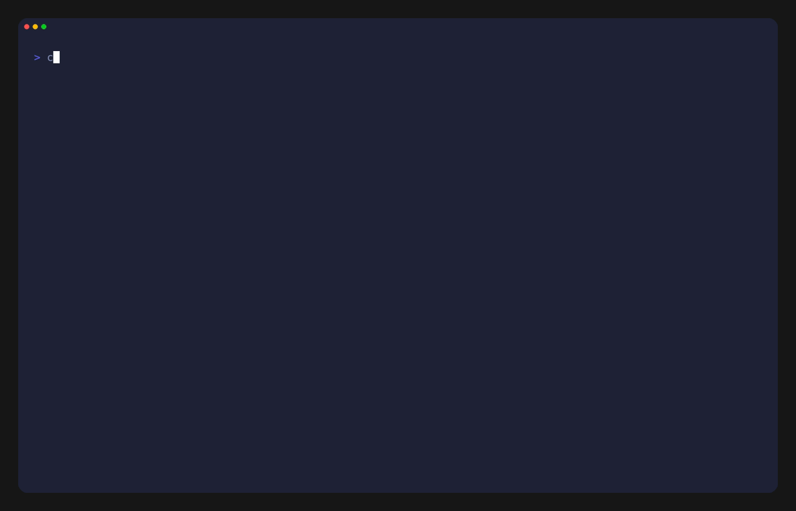
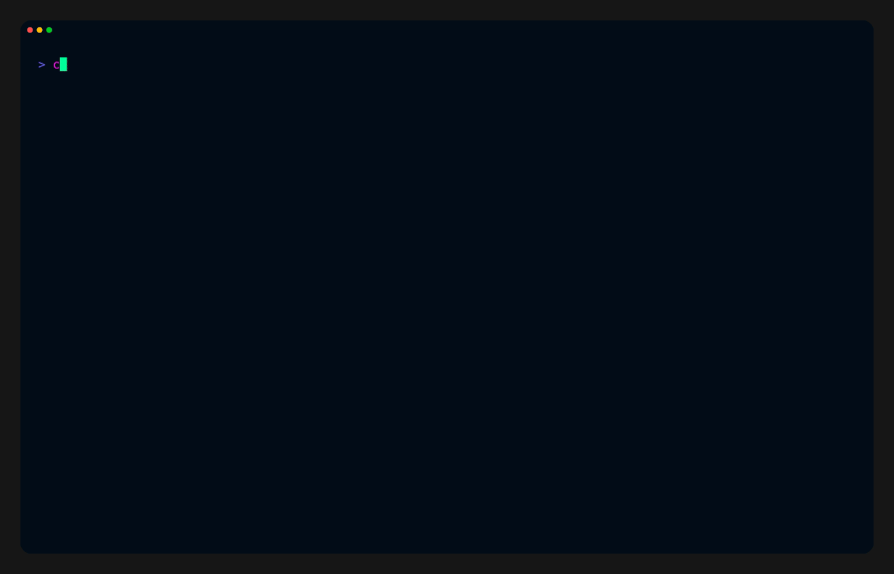
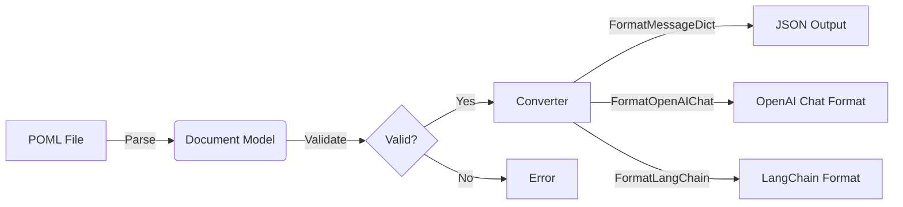
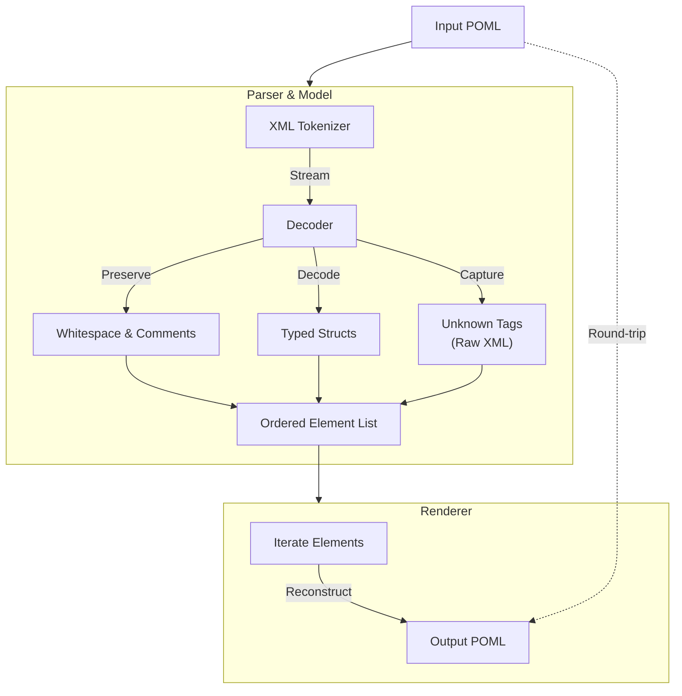

<p align="center">
  <a href="https://github.com/atlas-foundry/poml-go-sdk/actions/workflows/ci.yml">
    
  </a>
  <a href="https://github.com/atlas-foundry/poml-go-sdk/actions/workflows/ci.yml">
    
  </a>
  <a href="https://github.com/atlas-foundry/poml-go-sdk/actions/workflows/ci.yml">
    
  </a>
  <a href="https://github.com/atlas-foundry/poml-go-sdk/actions/workflows/ci.yml">
    
  </a>
  <a href="https://github.com/atlas-foundry/poml-go-sdk/actions/workflows/ci.yml">
    
  </a>
  <a href="https://github.com/atlas-foundry/poml-go-sdk/releases">
    
  </a>
</p>
<p align="center">
  <a href="https://img.shields.io/github/go-mod/go-version/atlas-foundry/poml-go-sdk">
    
  </a>
  <a href="https://github.com/atlas-foundry/poml-go-sdk/blob/main/LICENSE">
    
  </a>
  <a href="https://pkg.go.dev/github.com/atlas-foundry/poml-go-sdk">
    
  </a>
  <a href="https://goreportcard.com/report/github.com/atlas-foundry/poml-go-sdk">
    
  </a>
  <a href="https://microsoft.github.io/poml">
    
  </a>
  <a href="./go.quality.poml">
    
  </a>
  <a href="https://www.conventionalcommits.org/">
    
  </a>
</p>

# poml-go-sdk

**The official Go SDK for [POML](https://microsoft.github.io/poml) — Prompt Orchestration Markup Language.**

* Full structured README: `README.poml`
* Delivery plan: `PLAN.poml`
* AI log: `AI.LOCK.poml`
* Fit-for-purpose plan: `docs/fit_for_purpose.poml`
* Agent rules: `AGENTS.poml`
* Go quality spec: `go.quality.poml`
* Multimedia examples: `poml/testdata/examples/*`

---

## Getting Started

Install the SDK using Go modules:

```bash
go get github.com/atlas-foundry/poml-go-sdk
```

Run the test suite to verify your installation:
## 🚀 Quick Start Guide

New to POML or Go? Here is how to get started in minutes.

### 1. Install the SDK

```bash
go get github.com/atlas-foundry/poml-go-sdk
```

### 2. Create a POML file

Create a file named `hello.poml`:

```xml
<poml>
  <system>
    You are a helpful assistant.
  </system>
  <user>
    Hello, world!
  </user>
</poml>
```

---

## Key Concepts

### Document
The `Document` type represents a parsed POML file. It contains structured sections like `Meta`, `Role`, `Task`, `Input`, messages, and media elements. Documents can be parsed from files, strings, or readers.

### Builder
The `poml.Builder` provides a fluent API for constructing POML documents programmatically (similar to Python's `Prompt` object). Use it to build prompts in code with type safety and validation.
### 3. Write your Go code

Create `main.go`:

```go
package main

import (
    "fmt"
    "log"

    "github.com/atlas-foundry/poml-go-sdk/poml"
)

func main() {
    // 1. Parse the POML file
    doc, err := poml.ParseFile("hello.poml")
    if err != nil {
        log.Fatalf("Failed to parse: %v", err)
    }

    // 2. Validate the document
    if err := poml.Validate(doc); err != nil {
        log.Fatalf("Validation failed: %v", err)
    }

    // 3. Convert to OpenAI Chat format
    output, err := poml.Convert(doc, poml.FormatOpenAIChat, poml.ConvertOptions{})
    if err != nil {
        log.Fatalf("Conversion failed: %v", err)
    }

    fmt.Println(string(output))
}
```

### 4. Run it!

```bash
go run main.go
```

---

## 🎬 See It in Action (VHS)

Two fresh tapes show both sides of the SDK—CLI and pure Go—using vivid terminal themes:

* **CLI quickstart**: Parse, validate, and convert a tiny POML file with a pocket CLI wrapper.

  

* **Go builder**: Assemble a document with the fluent builder, render it back to POML, and emit OpenAI Chat JSON.

  

---

## 📐 Spec Alignment & Coverage

- **Core spec (meta + components)**: Implemented with strict parsing/validation and round-trip rendering. See the canonical docs: [Meta](https://microsoft.github.io/poml/latest/language/meta/) and [Components](https://microsoft.github.io/poml/latest/language/components/). Rough coverage: ~95% of the published core; any gaps are tracked in `README.poml`.
- **Contributing expectations**: We mirror the upstream guidance for structure and clarity ([Contributing](https://microsoft.github.io/poml/latest/contributing/)). PRs should preserve the POML-first docs policy.
- **Tracing**: Python trace semantics are a reference point ([Trace docs](https://microsoft.github.io/poml/latest/python/trace/)). Go trace parity is planned; not implemented yet (0%).
- **Extended proposal**: The POML Extended proposal is our north star ([Deep dive](https://microsoft.github.io/poml/latest/deep-dive/proposals/poml_extended/)). No implementation yet (0%); we keep compatibility in mind for converters and validation.

---

## 🗺️ Roadmap (high level)

- 1️⃣ Core fidelity polish (Δ→ 100%): close remaining edge cases from the [Meta](https://microsoft.github.io/poml/latest/language/meta/) / [Components](https://microsoft.github.io/poml/latest/language/components/) specs; lock lossless round-trips for extended tags.
- 2️⃣ Tracing parity (Δ→ 100%): implement Go-side tracing inspired by [Python trace](https://microsoft.github.io/poml/latest/python/trace/) with structured spans, deterministic seeds, and regression fixtures.
- 3️⃣ Extended runway (Δ→ 30%): prototype safe subsets from the [POML Extended](https://microsoft.github.io/poml/latest/deep-dive/proposals/poml_extended/) proposal (custom ops, richer media), gated behind opt-in converters.
- 4️⃣ Ecosystem bridges (Δ→ 60%): deepen bindings (LangChain, OpenAI tools, CLI ergonomics) plus a POML ↔ `.tape` bridge for VHS stories.

## ✅ High-priority TODOs

- [ ] Tighten validator edge cases: unknown attributes, mixed inline content, and whitespace fidelity against upstream golden cases.
- [ ] Ship trace support in Go mirroring Python’s `trace/` semantics, with golden test fixtures and CLI flag parity.
- [ ] Add converter round-trip goldens for extended tags (hint/example/object/data) and publish % coverage alongside CI.
- [ ] Harden path safety: extend BaseDir/MaxMediaBytes tests with symlink and UNC path fixtures.
- [ ] Publish the `.tape` converter in `poml-horse` and wire sample journeys into docs/VHS for end-to-end demos.

### Onboarding at a glance (ASCII map)

```
┌──────────────┐   parse+validate    ┌──────────────┐   convert/render   ┌───────────────┐
│  POML file   │ ───────────────────▶│  poml-go SDK │───────────────────▶│  outputs/LLMs │
└──────────────┘                     └──────────────┘                    └───────────────┘
       ▲                ▲                    │                ▲
       │                │                    │ VHS demos      │
       │ tests/goldens  │ builder API        │ (CLI + Go)     │ ASCII guides
       └────────────────┴────────────────────┴────────────────┴──────────────
```

### `poml` CLI (MCP starter)

We ship an experimental Go CLI, `poml`, with an `mcp` subcommand that serves a minimal MCP-style HTTP surface for AST inspection:

```bash
go run ./cmd/poml mcp --file hello.poml --addr :7777
```

Endpoints:
* `/health` — readiness ping
* `/inspect` — doc summary (meta + element counts)
* `/ast` — serialized `poml.Document` (ordered elements preserved)
* `/validate` — structured validation result (line/column details)
* `/convert?format=dict|openai_chat|langchain|message_dict|pydantic` — on-demand conversion
* `/search?tag=&attr=&text=` — filter elements by tag, attribute, or body text
* `/tools` — list tool-defs/reqs/responses/results/errors
* `/diagram` — list diagram elements (nodes/edges/etc. included)
* `/roundtrip` — encode→parse→encode check for losslessness
* `/diff` — compare two POML bodies (POST json: {"a":"...","b":"..."})
* `/patch` — minimal edits for role/task/messages (POST json: {"tag":"role|task|human_msg|assistant_msg|system_msg","index":0,"body":"..."})
* `/watch` — SSE stream that pushes summaries when the source file changes (enabled when `--file` is provided)
* `/ws` — WebSocket endpoint that streams summaries (initial + on change) when `--file` is provided; supports heartbeat and optional auth via `POML_MCP_TOKEN`
* `/metrics` — request counts per endpoint (auth-respects `POML_MCP_TOKEN`)
* Tracing exporters: `--trace-stdout` (local dev), `--trace-otlp-http` or `--trace-otlp-grpc` (with `--trace-insecure` toggle)

Roadmap highlights (see `meta.plan.poml`):
* Search endpoints (tag/attr/text), validation error details, conversions on demand.
* Tool/diagram introspection, media safety signals, round-trip checks.
* OTEL tracing/metrics (toggle with `--trace-stdout`), watch/reload + push, patch/diff APIs, auth toggle.
* Future docs + VHS demo when feature set stabilizes.

---

## 📚 Documentation Strategy (beacon mode)

- **Doc plan**: living strategy in `docs/doc_plan.poml` (audiences, pillars, owners, timelines). Keep it in sync with code and releases.
- **Spec links**: [Meta](https://microsoft.github.io/poml/latest/language/meta/) · [Components](https://microsoft.github.io/poml/latest/language/components/) · [Trace](https://microsoft.github.io/poml/latest/python/trace/) · [Extended](https://microsoft.github.io/poml/latest/deep-dive/proposals/poml_extended/)
- **Content set**: `README.mdx` (landing), `README.poml` (structured), `PLAN.poml` / `meta.plan.poml` (execution), `go.quality.poml` (code bar), `docs/vhs/*.tape|.gif` (motion), more guides in `docs/*.poml`.
- **Quality bar**: every feature ships with docs + runnable example or VHS; linkcheck/spellcheck + gofmt for snippets; coverage/spec % published.

ASCII doc flow:
```
Specs & code ▶ tests/goldens ▶ docs (POML + README) ▶ demos (VHS) ▶ users/agents
```

---

## 📘 Documentation

### Core Components

The SDK is built around four main pillars:

1.  **Parser**: Reads POML files and converts them into a Go struct (`*poml.Document`). It handles XML parsing, whitespace normalization, and tag processing.
2.  **Validator**: Checks the parsed document against the POML specification. It ensures required tags are present, nesting is correct, and attributes are valid.
3.  **Renderer**: Converts the `*poml.Document` back into a POML string. Useful for programmatic editing or formatting.
4.  **Converter**: Transforms the `*poml.Document` into other formats like JSON, OpenAI Chat messages, or LangChain tool calls.

### Architecture Overview



### Lossless Parsing Pipeline

We take pride in our parser's ability to round-trip POML files without losing a single byte of important information.



The parser ensures losslessness by:
1.  **Preserving Whitespace**: All leading/trailing whitespace and comments are kept intact.
2.  **Maintaining Order**: The exact order of elements is preserved, not just the structure.
3.  **Capturing Unknowns**: Unknown tags are captured as raw XML, ensuring forward compatibility with future POML versions.

### Supported Formats

| Format | Description |
| :--- | :--- |
| `FormatMessageDict` | Generic JSON dictionary format. |
| `FormatOpenAIChat` | OpenAI Chat Completion API format. |
| `FormatLangChain` | LangChain tool calls format. |
| `FormatDict` | Python-style dictionary format (for debugging). |

---

### Convert
The `Convert` function transforms parsed POML documents into various formats for use with different LLM providers:
- `FormatOpenAIChat` — OpenAI chat completion format
- `FormatLangChain` — LangChain message format
- `FormatMessageDict` — Generic message dictionary
- `FormatDict` — Full document dictionary
- `FormatPydantic` — Pydantic-compatible output

Converters enforce safety rules: `BaseDir` containment (symlink-aware), 10MB default caps for media files (configurable via `MaxImageBytes`/`MaxMediaBytes`), and proper handling of extended tags.
* Fully spec-aligned parser
* Semantic validator
* Renderer + transformations
* Round-trip fidelity for extended tags (`<hint>`, `<example>`, `<cp>`, `<object>`, `<tool>`)
* Safety features (symlink-aware BaseDir checks, 10MB default caps for image/audio/video, override options)
* Strong test suite with example parity checks
* Elegant, friendly API

---

## Usage Examples

### Parsing a POML File

```go
package main

import (
    "fmt"
    "github.com/atlas-foundry/poml-go-sdk/poml"
)

func main() {
    // Parse from file
    doc, err := poml.ParseFile("story.poml")
    if err != nil {
        panic(err)
    }

    // Validate the document
    if err := poml.Validate(doc); err != nil {
        panic(err)
    }

    // Access structured fields
    fmt.Println("Role:", doc.Role.Body)
    fmt.Println("Task:", doc.Tasks[0].Body)
}
```

### Using the Builder (Prompt Construction)

```go
package main

import (
    "fmt"
    "github.com/atlas-foundry/poml-go-sdk/poml"
)

func main() {
    // Build a prompt programmatically
    doc := poml.NewBuilder().
        Meta("my-prompt", "1.0.0", "me").
        Role("You are a helpful assistant.").
        Task("Explain quantum computing to a 10-year-old.").
        Human("What is quantum computing?").
        Build()

    // Encode to POML string
    output, err := poml.EncodeWithOptions(doc, poml.EncodeOptions{
        Indent: "  ",
        Header: true,
    })
    if err != nil {
        panic(err)
    }
    fmt.Println(output)
}
```

### Converting to OpenAI Format

```go
package main

import (
    "encoding/json"
    "fmt"
    "github.com/atlas-foundry/poml-go-sdk/poml"
)

func main() {
    doc, err := poml.ParseFile("prompt.poml")
    if err != nil {
        panic(err)
    }

    // Convert to OpenAI chat format with safety options
    result, err := poml.Convert(doc, poml.FormatOpenAIChat, poml.ConvertOptions{
        BaseDir:            "./assets",
        AllowAbsImagePaths: false,
        MaxImageBytes:      10 << 20, // 10MB cap
        MaxMediaBytes:      10 << 20, // 10MB cap for audio/video
    })
    if err != nil {
        panic(err)
    }

    // Use the result with OpenAI
    jsonData, err := json.MarshalIndent(result, "", "  ")
    if err != nil {
        panic(err)
    }
    fmt.Println(string(jsonData))
}
```

---

## Parity & Compliance

This SDK is designed to maintain parity with the **Python reference implementation** and adheres to the official [POML specification](https://microsoft.github.io/poml). Key compliance features:
```
poml/
  parser.go       # Core parsing logic
  renderer.go     # POML generation
  converter.go    # Format conversion
  validator.go    # Semantic validation
  testdata/       # Example POML files
docs/             # Documentation
.github/          # CI/CD workflows
```

- ✅ Full spec-aligned parser with round-trip fidelity
- ✅ Support for extended tags: `<hint>`, `<example>`, `<cp>`, `<object>`, `<tool>`
- ✅ Multimedia handling: images, audio, video with proper MIME detection
- ✅ Format converters matching Python SDK outputs (message_dict, dict, openai_chat, langchain, pydantic)
- ✅ Semantic validation for required sections (meta, role, task)
- ✅ Safety features: symlink-aware path containment, configurable size limits

The SDK uses fixtures from the Python SDK and maintains parity through automated tests. See `poml/testdata/examples/` for example POML files with expected outputs.

---

## Repository Documentation

> **Note:** This repository uses POML for all documentation.  
> The only non-POML doc allowed is this `README.mdx` (for GitHub rendering).

Structured documentation files:
- **[README.poml](README.poml)** — Full structured README with usage guidance
- **[PLAN.poml](PLAN.poml)** — Development roadmap and milestones
- **[AI.LOCK.poml](AI.LOCK.poml)** — Automated run timeline and logs
- **[docs/fit_for_purpose.poml](docs/fit_for_purpose.poml)** — Validation goals and benchmarks
- **[AGENTS.poml](AGENTS.poml)** — Rules and guidelines for automation agents
- **[poml/testdata/examples/](poml/testdata/examples/)** — Multimedia examples and parity fixtures

### Contribution Rules

When contributing to this repository:
- **Do not** add markdown/org/mdx files besides `README.mdx`
- Author all docs in POML (`*.poml`) using extended tags (`hint`, `example`, `cp`, `object`, `list`, etc.)
- Keep new instructions in `AGENTS.poml` for discoverability
- Link high-signal docs from this README.mdx

---

## Media & Safety Rules

Converters enforce strict safety rules to prevent accidental file system access and resource exhaustion:

- **BaseDir Containment**: All relative paths are resolved within a specified `BaseDir`. Symlink-aware checks prevent directory traversal attacks.
- **Absolute Path Control**: Absolute image paths are disabled by default (enable via `AllowAbsImagePaths`).
- **Size Limits**: Default 10MB caps for image, audio, and video files. Override via `MaxImageBytes`/`MaxMediaBytes` in `ConvertOptions` (set to `-1` to disable).
- **Format Emission**: Extended tags (`<hint>`, `<example>`, `<cp>`, `<object>`) and multimedia content are properly emitted as user context across all conversion formats.

Example with safety options:

```go
result, err := poml.Convert(doc, poml.FormatOpenAIChat, poml.ConvertOptions{
    BaseDir:            "./assets",
    AllowAbsImagePaths: false,      // Disallow absolute paths
    MaxImageBytes:      5 << 20,    // 5MB image cap
    MaxMediaBytes:      20 << 20,   // 20MB audio/video cap
})
```

---

## Project Structure

```
poml/                          # Core SDK package
  parser.go                    # POML parser (file/string/reader)
  builder.go                   # Fluent API for document construction
  converter.go                 # Format converters (OpenAI, LangChain, etc.)
  renderer.go                  # POML renderer
  testdata/examples/           # Example POML files with golden outputs
docs/                          # Additional documentation (in POML)
tools/                         # Development tools
.github/                       # CI workflows and templates
```

---

## Conventional Commits

This project uses [Conventional Commits](https://www.conventionalcommits.org/) for semantic versioning:

```
feat: add something new ✨
fix: squish a bug 🐛
docs: improve docs 📘
chore: misc tasks 🧹
test: add/modify tests 🧪
ci: workflow updates ⚙️
refactor: structural changes 🧠
```

For breaking changes, use `!`:
```
feat!: major API change
```

---

## Contributing

We welcome contributions from everyone! Whether you're:
- New to Go
- New to POML
- New to open source

Your contributions are valued. Open a PR, file an issue, add test cases, or improve documentation. Let's build something wonderful together! ✨

---

## License

MIT License — see [LICENSE](LICENSE) for details.

- Do **not** add markdown/org/mdx files besides this `README.mdx`.
- Author docs in POML (`*.poml`) using extended tags (hint/example/cp/object/list/etc.).
- Keep new instructions in `AGENTS.poml` to stay discoverable for small-context agents.
- Repository Copilot guidance: `.github/copilot-instructions.md`.
- When adding docs, link them from this README.mdx if they are high-signal.
- Media rules: converters enforce BaseDir containment, default 10MB caps for image/audio/video (override via MaxImageBytes/MaxMediaBytes), and emit multimedia across formats.

## Learn More

- **POML Specification**: [https://microsoft.github.io/poml](https://microsoft.github.io/poml)
- **Go Package Documentation**: [pkg.go.dev/github.com/atlas-foundry/poml-go-sdk](https://pkg.go.dev/github.com/atlas-foundry/poml-go-sdk)
- **Python Reference SDK**: [microsoft/poml](https://github.com/microsoft/poml)

If you're thinking "Should I open a PR?" — the answer is **YES**. 💖
If you’re thinking “Should I open a PR?” the answer is YES.
Let’s build something wonderful together ✨💖
